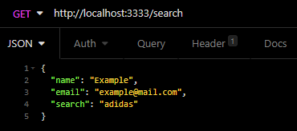
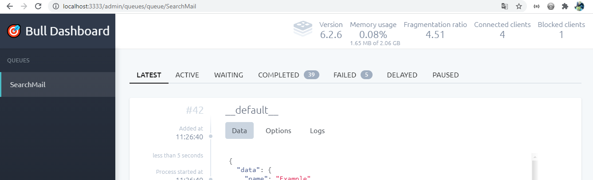

# VTEX Search
Trabalhando com filas de processamento para envio de email utilizando a API de search da VTEX 

## Como executar?

**Primeiros Passos**

* Tenha uma instância do Redis em funcionamento no *localhost* utilizando a porta *6379*:
  * *Caso deseje você pode abrir o arquivo '.env.example' e definir outro host e outra porta para a aplicação acessar o Redis.*

* Crie uma conta no site [Mailtrap](https://mailtrap.io/):
  * Crie uma nova caixa de entrada no botão **AddInbox** com o nome que desejar;
  * Selecione a integração com o NodeJS e copie as credenciais de acesso;
  * No arquivo '.env.example' preencha os campos do Mailtrap com as credenciais de acesso da caixa de entrada.

* Renomeie o arquivo '.env.example' da raiz do projeto para '.env'.

**Rodando a Aplicação**

*Com o terminal aberto na raiz do projeto e com o Redis em funcionamento faça:*

* Execute *npm install* ou *yarn* para instalar as dependências;
* Execute *npm run dev* ou *yarn dev* para iniciar a aplicação.

## Rotas da Aplicação

* *http://localhost:3333/search* - Rota para a busca e envio do e-mail | **Acessar esta rota com um software para consumo de rotas como o Insomnia** |
  * Parâmetros do Cabeçalho da Requisição:
    * Content-Type: application/json   
  * Parâmetros do Corpo da Requisição:
    * name: string
      * Nome do destinatário - Obrigatório
    * email: string
      * E-mail do destinatário - Obrigatório
    * search?: string
      * Texto de busca por produtos - Opcional (Caso não informado, retorna todos os produtos)

 
 

* *http://localhost:3333/admin/queues* - Rota do painel de monitoramento das filas de processamento dos e-mails | **Acessar esta rota pelo navegador!** |

